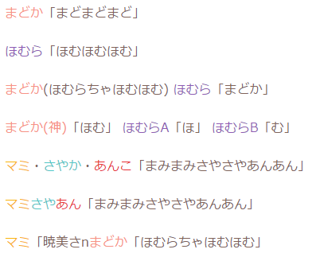

===================================

[![][npm-badge]][npm-link]
[![][travis-badge]][travis-link]
[![][david-runtime-badge]][david-runtime-link]
[![][david-dev-badge]][david-dev-link]
[![][mit-badge]][mit-link]

[](https://nodei.co/npm/homula/)

**Homula** is an analyzer of Novel of Japanese.

```
まどか「まどまどまど」

ほむら「ほむほむほむ」

まどか(ほむらちゃほむほむ) ほむら「まどか」

まどか(神)「ほむ」 ほむらA「ほ」 ほむらB「む」

マミ・さやか・あんこ「まみまみさやさやあんあん」

マミさやあん「まみまみさやさやあんあん」

マミ「暁美さnまどか「ほむらちゃほむほむ」
```
↑ Compile using **Homula**... ↓
``` html
<style>.a{color:#f79286}.b{color:#8f5ab5}.c{color:#f9b30e}.d{color:#52c7c7}.e{color:#e82f36}.f{color:#929292}</style>

<b class=a>まどか</b>「まどまどまど」<br>
<br>
<b class=b>ほむら</b>「ほむほむほむ」<br>
<br>
<b class=a>まどか</b>(ほむらちゃほむほむ)<b class=b> ほむら</b>「まどか」<br>
<br>
<b class=a>まどか(神)</b>「ほむ」<b class=b> ほむらA</b>「ほ」<b class=b> ほむらB</b>「む」<br>
<br>
<b class=c>マミ</b>・<b class=d>さやか</b>・<b class=e>あんこ</b>「まみまみさやさやあんあん」<br>
<br>
<b class=c>マミ</b><b class=d>さや</b><b class=e>あん</b>「まみまみさやさやあんあん」<br>
<br>
<b class=c>マミ</b>「暁美さn<b class=a>まどか</b>「ほむらちゃほむほむ」
```
↑ Yeah! ↓



Features :sparkles:
-------------------
* Origin inference
* Characters statistics
* Compile to HTML
* Thread utilities
  * Anchor tracking
  * Extract trips
  * Extract master posts

Install :package:
-----------------
``` bash
npm install homula
```

Usage :bulb:
------------

### Basic

``` js
import * as homula from 'homula';

// Init a novel instance
const novel = new homula.Novel({
	title: '櫻子「ナデナデシテー」',
	text: '＜向日葵の家＞\n\n櫻子「向日葵～……」\n\n向日葵「何ですの？」\n\n...',
	characters: [{
		name: ['向日葵', 'ひま'],
		color: '#416798'
	}, {
		name: ['櫻子', 'さく'],
		color: '#e2b03a'
	}]
});

// Compile
const html = novel.toHtml();
```

### Detect origin
Homula can detect a origin(ゆるゆり, まどマギ, ごちうさ, etc etc...) of any contents.
To do the detect, you must have a database of all of the origin.

**Database definition:**
``` js
const allorigin = [
	{
		id: 'a',
		title: ['魔法少女まどか☆マギカ', 'まどか☆マギカ', 'まどマギ']
	}, {
		id: 'b',
		title: ['ゆるゆり']
	}, {
		id: 'c',
		title: ['ご注文はうさぎですか？', 'ごちうさ']
	},
	...
];

const allchars = [
	{
		origin: 'a',
		name: ['まどか', 'まど'],
		color: '#f79286'
	}, {
		origin: 'a',
		name: ['ほむら', 'ほむ', 'ほむほむ'],
		color: '#8f5ab5'
	}, {
		origin: 'b',
		name: ['あかり', 'あか'],
		color: '#ff2445'
	}, {
		origin: 'b',
		name: ['向日葵', 'ひま'],
		color: '#416798'
	}, {
		origin: 'b',
		name: ['櫻子', 'さく'],
		color: '#e2b03a'
	},
	...
];

const world = new homula.Utility.World(allorigin, allchars);
```

**Now, we can detect origin of a novel:**
``` js
const title = '櫻子「ナデナデシテー」';
const text = '＜向日葵の家＞\n\n櫻子「向日葵～……」\n\n向日葵「何ですの？」\n\n...';

const [origin] = homula.Utility.detectOrigin(world, title, text);

console.log(origin.id); // <- b
```

License :copyright:
-------------------
[MIT](LICENSE)

[npm-link]: https://www.npmjs.com/package/homula
[npm-badge]: https://img.shields.io/npm/v/homula.svg?style=flat-square
[travis-link]: https://travis-ci.org/syuilo/homula
[travis-badge]: https://img.shields.io/travis/syuilo/homula.svg?style=flat-square
[david-runtime-link]: https://david-dm.org/syuilo/homula#info=dependencies&view=table
[david-runtime-badge]: https://img.shields.io/david/syuilo/homula.svg?style=flat-square
[david-dev-link]: https://david-dm.org/syuilo/homula#info=devDependencies&view=table
[david-dev-badge]: https://img.shields.io/david/dev/syuilo/homula.svg?style=flat-square
[mit-link]:  http://opensource.org/licenses/MIT
[mit-badge]: https://img.shields.io/badge/license-MIT-444444.svg?style=flat-square
